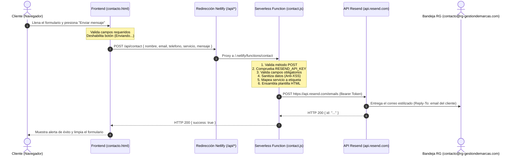

# 📧 Funcionamiento del Sistema de Envío de Correos
**RG Gestión de Marcas — Documentación Técnica**

Este documento describe en detalle la arquitectura, el flujo de datos, la seguridad, las plantillas y la configuración del sistema de envío de correos del formulario de contacto.

---

## 🗺️ 1. Diagrama de Arquitectura y Flujo



---

## 💻 2. Capa Frontend (`contacto.html`)

### 2.1. Estructura del Formulario
El formulario captura 5 campos principales:

| Campo | ID / Nombre | Tipo | Requerido | Descripción |
| :--- | :--- | :--- | :---: | :--- |
| **Nombre** | `#nombre` | `text` | Sí | Nombre del cliente o empresa |
| **Email** | `#email` | `email` | Sí | Correo electrónico para respuesta |
| **Teléfono** | `#telefono` | `tel` | No | Número de teléfono / WhatsApp |
| **Servicio** | `#servicio` | `select` | No | Categoría del servicio de interés |
| **Mensaje** | `#mensaje` | `textarea` | Sí | Detalle o consulta del proyecto |

### 2.2. Manejo de Estados y Eventos (`contacto.html`)
El envío se realiza de forma asíncrona mediante `fetch` sin recargar la página:

1. **Prevención por defecto**: Intercepta `event.preventDefault()`.
2. **Estado de Carga (Loading)**:
   - Deshabilita el botón `#submitBtn` (`btn.disabled = true`).
   - Cambia el texto del botón a `"Enviando..."`.
   - Limpia alertas previas en `#formNotification`.
3. **Petición HTTP**: Envía un `POST` con `Content-Type: application/json` hacia `/api/contact`.
4. **Respuesta Exitosa (HTTP 200)**:
   - Añade las clases CSS `form-notification success visible`.
   - Muestra el mensaje: *"¡Mensaje enviado! Te responderemos pronto."*
   - Limpia los campos del formulario con `e.target.reset()`.
5. **Manejo de Errores (HTTP 4xx / 5xx o Fallo de Red)**:
   - Añade las clases CSS `form-notification error visible`.
   - Muestra el mensaje de error devuelto por la API o un mensaje genérico de contingencia.
6. **Restauración de UI (Finally)**:
   - Reactiva el botón (`btn.disabled = false`).
   - Restablece el texto original del botón.

---

## 🔀 3. Enrutamiento y Capa de Redirección

En el archivo de configuración [`netlify.toml`](file:///c:/Users/alian/Desktop/Apps/RG_WebPage/netlify.toml):

```toml
[build]
  functions = "netlify/functions"

[[redirects]]
  from = "/api/*"
  to = "/.netlify/functions/:splat"
  status = 200
```

- Cualquier llamada a `/api/contact` se redirige de forma transparente a la función serverless `/.netlify/functions/contact` manteniendo el método `POST` y el cuerpo JSON.

---

## ⚙️ 4. Capa Backend Serverless

Existen dos implementaciones idénticas en lógica para soportar distintos entornos de despliegue:
- **Netlify Functions (Producción Activa)**: [`netlify/functions/contact.js`](file:///c:/Users/alian/Desktop/Apps/RG_WebPage/netlify/functions/contact.js) en formato **CommonJS** (`exports.handler = async function(event)`).
- **Vercel Functions (Respaldo)**: [`api/contact.js`](file:///c:/Users/alian/Desktop/Apps/RG_WebPage/api/contact.js) en formato **ESM** (`export default async function handler(req, res)`).

### 4.1. Validaciones del Servidor

1. **Método HTTP**: Solo permite peticiones `POST`. Cualquier otro método devuelve `405 Method Not Allowed`.
2. **Presencia de Credenciales**: Comprueba `process.env.RESEND_API_KEY`. Si no existe, devuelve `500 Servicio de email no configurado.`
3. **Parseo del Payload**: Valida que el body sea un JSON válido; si falla, devuelve `400 JSON inválido en el body.`
4. **Campos Requeridos**: Verifica que `nombre`, `email` y `mensaje` contengan valores no vacíos. Si alguno falta, devuelve `400 Faltan campos requeridos: nombre, email y mensaje.`

### 4.2. Mapeo de Servicios
Convierte los identificadores del formulario en etiquetas legibles en español para el correo:

```javascript
const servicioLabel = {
    investigacion: 'Investigación de Mercados',
    naiming:       'Naming, Diseño y Producción',
    web:           'Diseño Web',
    redes:         'Gestión de Redes Sociales',
    cursos:        'Cursos y Capacitación',
    otro:          'Otro',
}[servicio] || servicio || 'No especificado';
```

### 4.3. Seguridad y Sanitización Anti-XSS
Para evitar inyecciones de código malicioso o rotura de layout en los clientes de correo, todos los datos ingresados por el usuario pasan por la función de sanitización:

```javascript
function escapeHtml(str) {
    return String(str)
        .replace(/&/g, '&amp;')
        .replace(/</g, '&lt;')
        .replace(/>/g, '&gt;')
        .replace(/"/g, '&quot;')
        .replace(/'/g, '&#39;');
}
```

---

## 🎨 5. Plantilla de Correo HTML

El correo enviado a la agencia cuenta con una plantilla HTML responsive diseñada con la identidad visual corporativa de **RG Gestión de Marcas**:

- **Fondo General**: `#0a0a0a` (Dark mode elegante).
- **Tarjeta Contenedora**: `#121212` con bordes redondeados y borde sutil.
- **Cabecera**: Color amarillo institucional `#f6cf3d` con tipografía en negro (`#121212`) y el logo "RG Gestión de Marcas".
- **Bloques de Datos**: Tarjetas oscuras (`#1e1e1e`) con borde lateral amarillo de 3px para:
  - 👤 **Nombre del remitente**
  - ✉️ **Correo electrónico**
  - 📞 **Teléfono** (o *"No proporcionado"*)
  - 🎯 **Servicio de interés**
  - 💬 **Mensaje completo** (con preservación de saltos de línea `white-space: pre-wrap`)
- **Botón de Acción Rápida (CTA)**: Enlace `mailto:${email}` para responder directamente al cliente con un solo clic.
- **Pie de Correo**: Información oficial de contacto y aviso de generación automática.

---

## 📤 6. Integración con la API de Resend

La función realiza un `fetch` autenticado a la API de Resend:

- **Endpoint**: `https://api.resend.com/emails`
- **Método**: `POST`
- **Headers**:
  - `Content-Type: application/json`
  - `Authorization: Bearer ${process.env.RESEND_API_KEY}`
- **Payload**:
  ```json
  {
    "from": "RG Gestión de Marcas <noreply@rg-gestiondemarcas.com>",
    "to": ["contacto@rg-gestiondemarcas.com"],
    "reply_to": "<correo_del_cliente>",
    "subject": "Nueva consulta de <Nombre> — <Servicio>",
    "html": "<Plantilla_HTML_Generada>"
  }
  ```

### Características clave del envío:
- **`reply_to` automático**: Permite al equipo de RG presionar *"Responder"* en su gestor de correo (Gmail, Outlook, etc.) y responder directamente a la dirección del cliente sin tener que copiarla manualmente.
- **Remitente verificado (`from`)**: Usa el dominio oficial `noreply@rg-gestiondemarcas.com`, configurado y verificado con registros DNS (SPF, DKIM, DMARC) en Resend para garantizar alta entregabilidad y evitar la bandeja de SPAM.

---

## 🔐 7. Variables de Entorno y Configuración

| Variable | Descripción | Dónde se configura |
| :--- | :--- | :--- |
| `RESEND_API_KEY` | Clave API generada en la consola de [Resend.com](https://resend.com) | Panel de Netlify (**Site settings > Environment variables**) o `.env` local |

> [!CAUTION]
> Nunca commitear la clave `RESEND_API_KEY` en Git ni exponerla en el frontend. La clave debe residir exclusivamente en el backend serverless.

---

## 🧪 8. Pruebas Locales y Depuración

### 8.1. Ejecución Local con Netlify CLI
Dado que las funciones serverless requieren Node.js y variables de entorno, no se pueden probar directamente abriendo `index.html` en el navegador:

1. Instalar o ejecutar Netlify CLI:
   ```bash
   npx netlify dev
   ```
2. Asegurar que existe un archivo `.env` en la raíz con:
   ```env
   RESEND_API_KEY=re_tu_api_key_aqui
   ```
3. Abrir `http://localhost:8888/contacto.html` y realizar un envío de prueba.

### 8.2. Diagnóstico de Errores Comunes

| Síntoma / Error | Causa Raíz | Solución |
| :--- | :--- | :--- |
| `500 Servicio de email no configurado` | La variable `RESEND_API_KEY` no está definida en el entorno. | Agregar `RESEND_API_KEY` en Netlify o en el archivo `.env`. |
| `400 Faltan campos requeridos` | Uno de los campos obligatorios (`nombre`, `email`, `mensaje`) se envió vacío. | Verificar que los inputs del formulario tengan valores válidos. |
| `403 Domain not verified / Forbidden` | El dominio `rg-gestiondemarcas.com` no está verificado en Resend. | Completar la verificación DNS de DKIM/SPF en la cuenta de Resend. |
| `405 Method not allowed` | Se intentó hacer una petición `GET` a `/api/contact`. | El endpoint solo acepta peticiones `POST`. |
